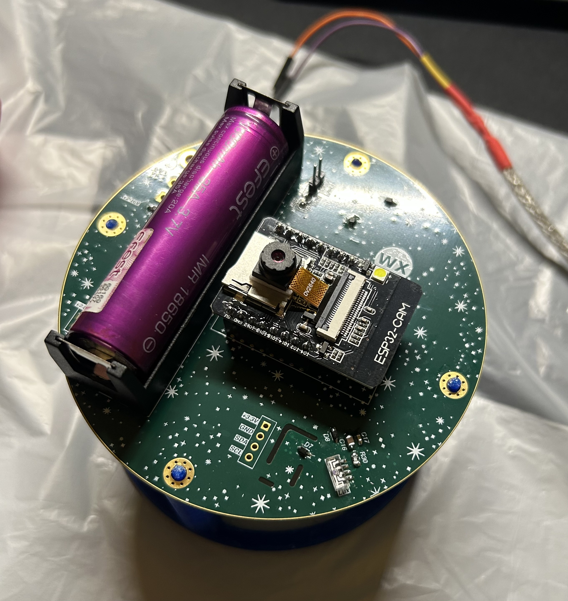
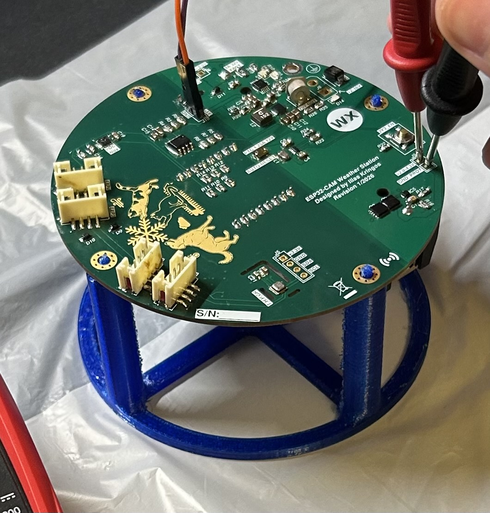
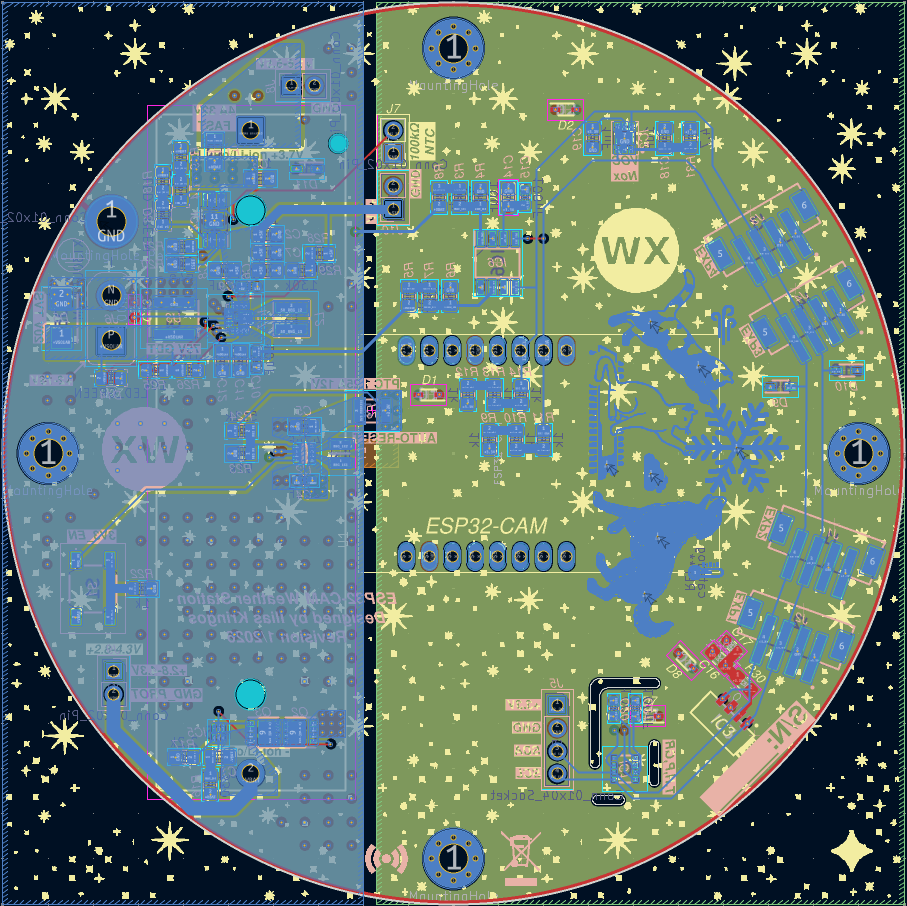
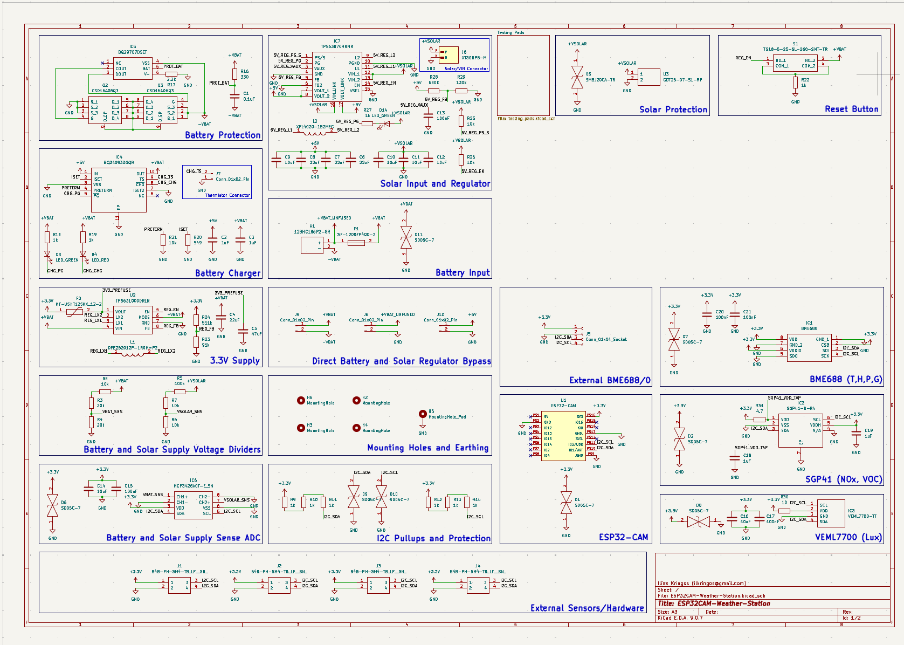

# ESP32CAM-Weather-Station

## Electronics

This project uses a custom weather-station PCB that combines **power management**, **protection**, and an **I2C sensor/expansion bus**.

### Power features
- Supports **battery input** with input protection.
- Supports **solar input** with surge/transient protection.
- Includes **battery charging** (status indicators and a battery temperature/thermistor input).
- Provides regulated rails for the rest of the system (including a **3.3V rail** for sensors/logic).
- Breakouts/headers for accessing power rails (battery and regulated output) for debugging or external loads.

### Measurement & sensing features
- On-board sensing for **battery voltage** and **solar/charging voltage**.
- On-board environmental sensing (temperature/humidity/pressure/gas resistance).
- On-board gas sensing (VOC/NOx measurements).
- On-board ambient light sensing (lux).
- ESP32-CAM on-board sky camera.

### I2C bus + expansion features
- I2C bus includes **pullups** and **ESD/transient protection**.
- Multiple **external I2C expansion headers** (3.3V / GND / SDA / SCL) for additional sensors.

### Extras
- A PCB that makes the board compatible with the Raspberry Pi Pico (Original or W or 2 or 2W) is also included in the design files.

### Media (photos and design files)

> Photos below are from **testing / bring-up** and may show temporary wiring or rework.

**PCB front (testing photo)**  


**PCB back (testing photo)**  


**KiCad PCB layout (screenshot)**  


**Schematic (export image)**  


---

## Mechanical design (placeholder)

- TODO: enclosure details, mounting, weatherproofing, cable glands, venting strategy, sensor placement.
- TODO: 3D print files / CAD links, tolerances, and assembly steps.
- TODO: photos/diagrams.

---

## Software: Pico Weather Station (Client) + Local Ingest Server (HTTP + HMAC)

This project consists of:

- **Client (Raspberry Pi Pico 2 W)**: reads sensors over I2C and periodically posts measurements to a server.
- **Server (Python)**: accepts measurements over **HTTP** and protects the endpoint with:
  - Bearer token allow-list (multiple devices supported)
  - HMAC-SHA256 request signature (fast reject of unauthenticated spam)
  - Rate limiting (per IP and per token)
  - Max body size and max concurrency
  - CSV logging to two files (same schema)

> Security note: This design does **not** encrypt the data in transit (it is HTTP). It **does** prevent unauthorized clients from successfully sending data (and helps prevent trivial overload). If you need confidentiality, use HTTPS.

### Repository layout (recommended)

#### PlatformIO (client)
- `src/measurement_post_requests.cpp` (or `src/main.cpp`) — client code
- `include/client_config.h` — user-created (not committed)
- `include/wificredentials.h` — user-created (not committed)

#### Server (Python)
- `server/server_config.py`
- `server/server_http_hmac.py`

---

### 1) Server setup (Python)

#### 1.1 Requirements
- Python 3.9+ recommended (stdlib only)

No pip packages required.

#### 1.2 Files
Create a directory (example):
```
server/
  server_http_hmac.py
  server_config.py
```

#### 1.3 Configure `server_config.py`
Key options:
- Bind / endpoint: `HOST`, `PORT`, `INGEST_PATH`
- Auth: `AUTH_TOKENS`, `ALLOW_BEARER_HEADER`
- Protections: `REQUIRE_HMAC`, `REQUIRE_TIMESTAMP`, `RATE_LIMIT_*`, `MAX_BODY_BYTES`, `MAX_CONCURRENT_REQUESTS`
- CSV: `CSV_PATH_1`, `CSV_PATH_2`, `CSV_HEADER`

> If you are not setting time on the Pico (no NTP), set `REQUIRE_TIMESTAMP = False`.

#### 1.4 Run the server
From the `server/` directory:
```bash
python3 server_http_hmac.py
```

#### 1.5 Test health endpoint
```bash
curl http://<server-ip>:<port>/health
```

---

### 2) Client setup (PlatformIO / Pico 2 W)

#### 2.1 Create user config headers (required)
Create these two files under the PlatformIO include directory:
- `include/client_config.h`
- `include/wificredentials.h`

These should not be committed (they contain secrets).

##### `include/wificredentials.h`
```cpp
#pragma once

#define WIFI_SSID "YOUR_WIFI_SSID"
#define WIFI_PASS "YOUR_WIFI_PASSWORD"

#define USE_STATIC_IP 1

#if USE_STATIC_IP
  #define WIFI_LOCAL_IP   IPAddress(192,168,2,55)
  #define WIFI_DNS_IP     IPAddress(1,1,1,1)
  #define WIFI_GATEWAY_IP IPAddress(192,168,2,1)
  #define WIFI_SUBNET_IP  IPAddress(255,255,255,0)
#endif
```

##### `include/client_config.h`
```cpp
#pragma once

#define DEVICE_ID "pico2w-01"
#define SERVER_URL "http://192.168.2.8:8080/ingest"

// Token secret: must exist in server_config.AUTH_TOKENS
#define AUTH_TOKEN "CHANGE_ME_TO_A_LONG_RANDOM_SECRET"

#define POST_INTERVAL_MS 1000
#define HTTP_TIMEOUT_MS 5000
```
